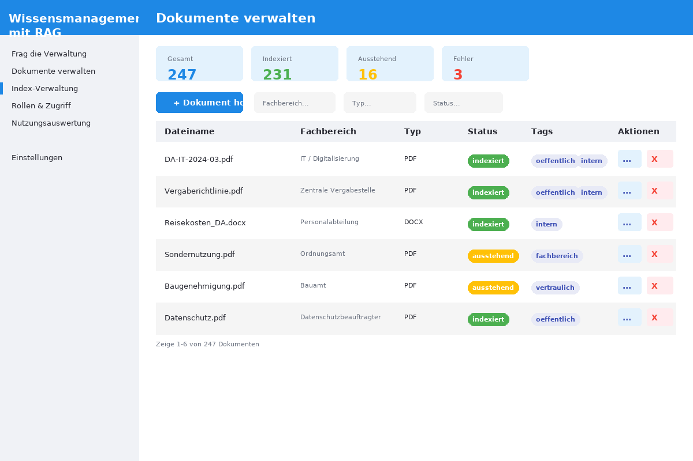

# Kommunales Wissensmanagement mit RAG – internes Behördenwissen sicher nutzbar machen

[](https://opensource.org/licenses/MIT)
[](https://python.org)
[](docs/datenschutz.md)
[-333?style=flat-square)](https://ollama.ai)
[](docker-compose.yml)

> **DE:** RAG-System für Kommunen — internes Wissen sicher, DSGVO-konform und komplett selbst gehostet. Keine Cloud-Dienste, keine externen KI-Anbieter.
>
> **EN:** RAG system for municipalities — internal knowledge securely, GDPR-compliant, and fully self-hosted. No cloud services, no external AI providers.

---

## Problem

In deutschen Behörden liegt wertvolles Wissen verstreut in PDFs, Word-Dokumenten, E-Mails und Intranet-Seiten. Sachbearbeiter:innen verbringen täglich Stunden mit der Suche nach Dienstvorschriften, Formularen oder Fachinformationen. Gängige KI-Lösungen (ChatGPT, Copilot) scheiden aus — Datenschutz, Datensicherheit und Souveränität verbieten den Einsatz US-amerikanischer Cloud-Dienste.

## Lösung

Ein **RAG-System (Retrieval-Augmented Generation)**, das ausschließlich lokal läuft:

- **Ollama** als KI-Engine — alle Daten bleiben im Rechenzentrum der Kommune
- **ChromaDB** als Vektordatenbank — kein Cloud-Anruf
- **Streamlit** als Weboberfläche — einfach im Browser bedienbar
- **DSGVO-konform** nach Design — keine personenbezogenen Daten verlassen das System

## Features

- [x] Natürliche Sprachanfragen an den Verwaltungs-Wissensbestand
- [x] Dokumenten-Upload: PDF, DOCX, TXT, Markdown
- [x] Automatische Textextraktion und intelligentes Chunking
- [x] Quellenangabe bei jeder Antwort mit Konfidenzbewertung
- [x] Rollen- und Berechtigungssystem (öffenlich, intern, Fachbereich, vertraulich)
- [x] Nutzungsauswertung und unbeantwortete Anfragen erkennen
- [x] Vollständig selbst gehostet — keine Cloud-Abhängigkeiten
- [x] DSGVO-konform nach Design

## 📸 Anwendung


*Fragen in natürlicher Sprache mit Quellenangaben*


*Upload und Verwaltung von Verwaltungsdokumenten*


*Statistiken und häufige Anfragen*

## Architektur

```
+--------------------------------------------------+
|              Streamlit Weboberfläche              |
|  +--------+ +--------+ +------+ +--------+      |
|  |  Chat  | |  Docs  | |Index | | Admin  |      |
|  +---+----+ +---+----+ +--+---+ +---+----+      |
+------|----------|--------|---------|-------------+
       |          |        |         |
+------v----------v--------v---------v-------------+
|              RAG-Pipeline (Python)                |
|  +-----------+ +---------+ +---------+ +----+   |
|  | Document  | | Text    | | Vector  | |Antw|   |
|  | Loader    | | Chunker | | Store   | |Eng |   |
|  +-----------+ +---------+ +---------+ +----+   |
+------|----------|--------|---------|-------------+
       |          |        |         |
+------v----------v--------v---------v-------------+
|              Infrastruktur (lokal)                |
|  +-------+  +--------+  +------+  +---------+  |
|  |Ollama |  |ChromaDB|  |PgSQL |  |Dateisyst.|  |
|  | (KI)  |  |(Vekt.) |  |(Meta)|  |(Docs)   |  |
|  +-------+  +--------+  +------+  +---------+  |
+--------------------------------------------------+
```

## Systemanforderungen

| Komponente | Minimum |
|---|---|
| CPU | 4 Kerne (8+ empfohlen für KI) |
| RAM | 8 GB (16+ empfohlen) |
| Speicher | 20 GB frei |
| Python | 3.11+ |
| Docker | 24.0+ (optional) |
| Ollama | neueste Version |

## Schnellstart

```bash
# 1. Repository klonen
git clone https://github.com/ceeceeceecee/wissensmanagement-ki.git
cd wissensmanagement-ki

# 2. Umgebungsvariablen einrichten
cp .env.example .env

# 3. Ollama starten und Modell laden
ollama serve
ollama pull llama3

# 4. Abhängigkeiten installieren
pip install -r requirements.txt

# 5. Datenbank initialisieren
python -c "from database.db_manager import DatabaseManager; DatabaseManager().init_db()"

# 6. Anwendung starten
streamlit run app.py
```

Die Anwendung ist dann unter `http://localhost:8501` erreichbar.

## Installation mit Docker

```bash
# docker-compose starten
docker compose up -d

# Ollama-Modell laden (lokal)
docker exec wissensmanagement-ollama ollama pull llama3
```

## Datenschutz & Sicherheit

- Alle Daten verbleiben im lokalen Netzwerk der Kommune
- Keine Datenübertragung an externe Dienste
- Rollenbasiertes Zugriffskontrolle (RBAC)
- Vertrauliche Dokumente nur für berechtigte Rollen sichtbar
- Protokollierung aller Anfragen mit Löschkonzept
- Siehe [docs/datenschutz.md](docs/datenschutz.md) für Details

## Berechtigungsmodell

| Rolle | öffentlich | intern | Fachbereich | vertraulich |
|---|---|---|---|---|
| Sachbearbeitung | Ja | Ja | Nein | Nein |
| Teamleitung | Ja | Ja | Ja | Nein |
| Verwaltung | Ja | Ja | Ja | Ja |

## Pilotbetrieb

Für einen erfolgreichen Pilotbetrieb wird empfohlen:

1. In einem Fachbereich starten (z.B. Jugendamt oder Bauamt)
2. 20-50 repräsentative Dokumente importieren
3. 5-10 Mitarbeitende einbinden
4. Feedback-Schleife über 4 Wochen etablieren
5. Nutzungsauswertung auswerten und iterieren

Siehe [docs/einfuehrungskonzept.md](docs/einfuehrungskonzept.md) für das vollständige Einführungskonzept.

## Dokumentation

- [Datenschutz](docs/datenschutz.md) — DSGVO-Konformität, Speicherung, Löschkonzept
- [Einführungskonzept](docs/einfuehrungskonzept.md) — Pilotbetrieb, Rollen, Feedback
- [Setup-Guide](docs/setup-guide.md) — Schritt-für-Schritt Installation
- [Nutzungsgrenzen](docs/nutzungsgrenzen.md) — Was das System kann und nicht kann

## Lizenz

Dieses Projekt steht unter der [MIT-Lizenz](LICENSE).

---

## 👤 Autor

**Cela** — Freelancer für digitale Verwaltungslösungen
