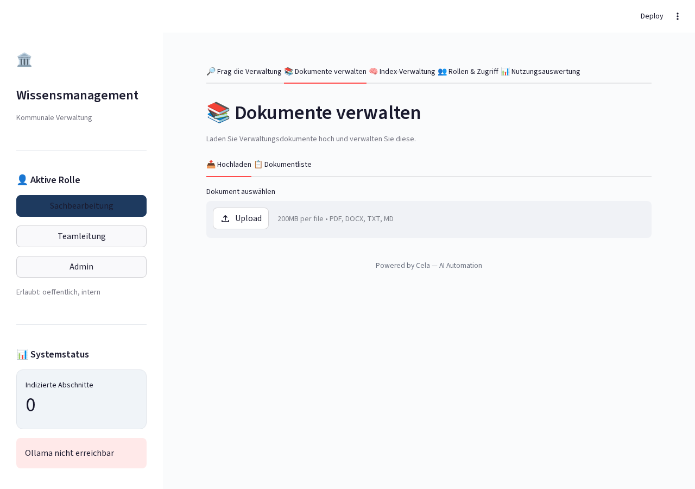
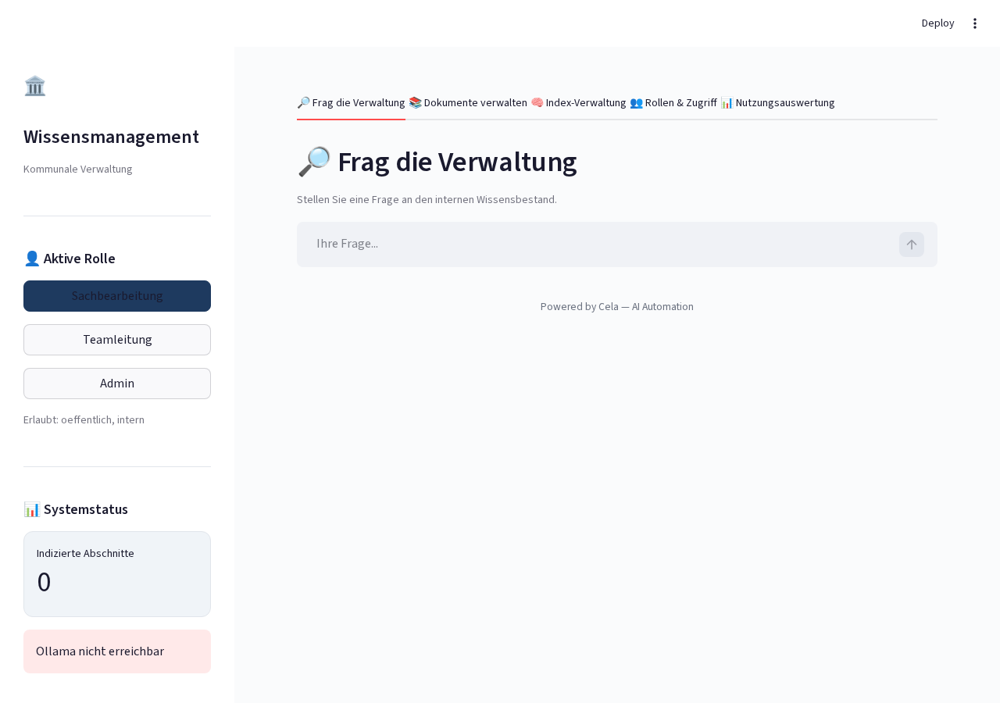
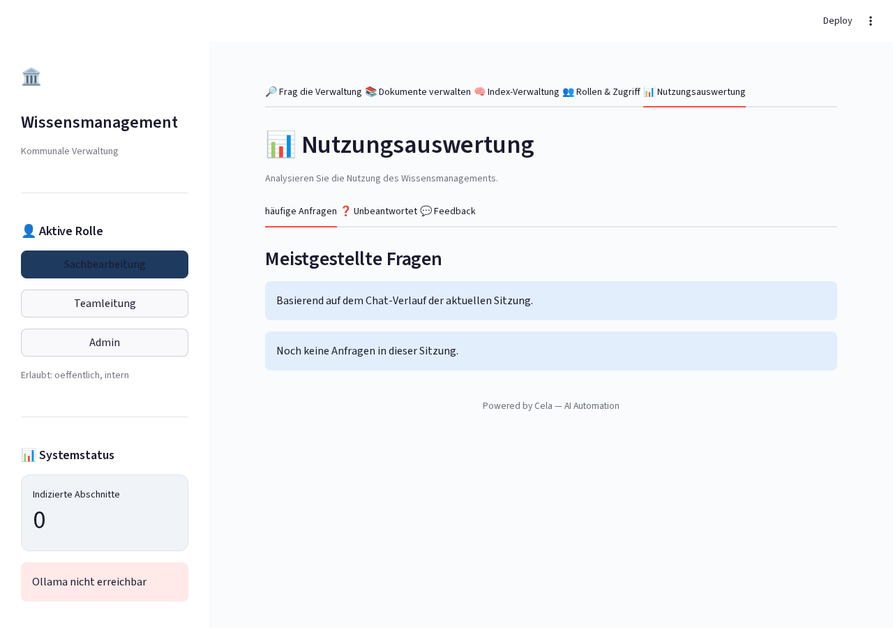

# Wissensmanagement Ki

<p align="center">
</p>

    

> Kommunales Wissensmanagement mit RAG — internes Behördenwissen sicher nutzbar machen

## Overview

RAG-basiertes Wissensmanagement für Kommunen. ChromaDB-Vektordatenbank, Ollama-Integration, Dokumenten-Upload und semantische Suche. Komplett self-hosted und DSGVO-konform.

## Features

- RAG-basierte Wissensabfrage
- ChromaDB Vektordatenbank
- Dokumenten-Upload und Indexierung
- Semantische Suche
- Chat-Interface
- Analytics-Dashboard

## Tech Stack

| Tech | Zweck |
|------|-------|
| Python 3.11+ | Backend |
| Streamlit | Web-Interface |
| Ollama | LLM |
| ChromaDB | Vektordatenbank |
| Docker | Deployment |

## Quick Start

```bash
pip install -r requirements.txt
streamlit run app.py
```

## Screenshots

**Dokumenten-Management**



**Chat-Interface für Wissensabfrage**



**Analytics-Dashboard**



---

## Contributing

Beiträge sind willkommen! Bitte erstelle einen Issue oder Pull Request.

## License

MIT License — siehe [LICENSE](LICENSE).

<p align="center">
</p>